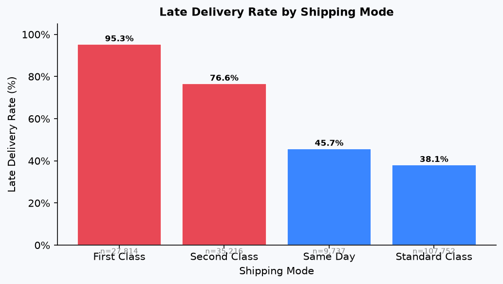
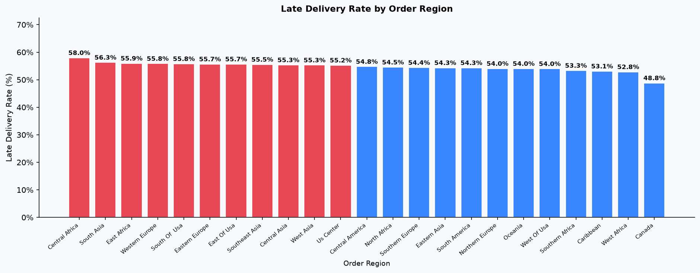
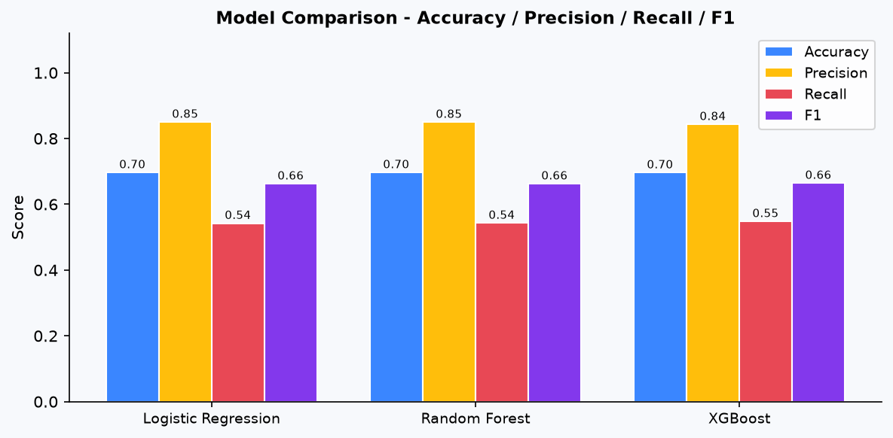
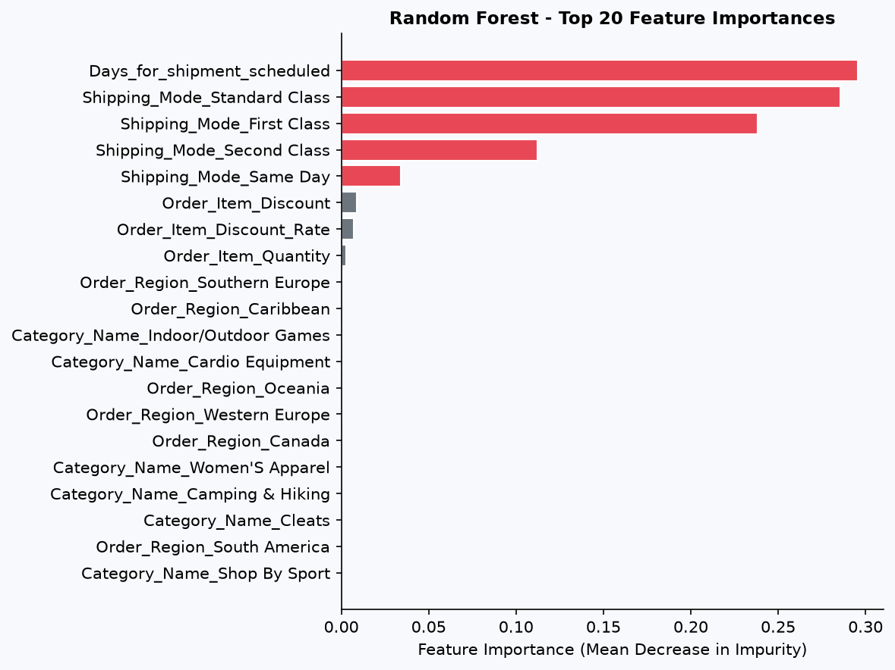

# 📦 Supply Chain Delay Risk Analysis & Prediction Engine

[](https://www.python.org/)
[](https://scikit-learn.org/)
[](https://xgboost.ai/)
[](https://pandas.pydata.org/)
[](report/Supply_Chain_Delay_Risk_Analysis.pdf)

> An end-to-end data analytics & machine learning project investigating root causes of late shipments across 180,000+ global supply chain orders, complete with statistical significance testing, leak-free predictive modeling, and an executive business report.

---

## 📌 Executive Summary

Late shipments are one of the costliest operational bottlenecks in e-commerce and logistics—triggering SLA penalties, customer churn, and expensive emergency freight. 

In this project, I analyzed the **DataCo Smart Supply Chain Dataset** (180,519 records) to answer three core questions:
1. **How bad is the delay problem?** *(54.8% of all shipments were delivered late)*
2. **What is fundamentally causing it?** *(Is it regional infrastructure, order complexity, or unrealistic shipping promises?)*
3. **Can we predict delays before orders leave the warehouse?** *(Built an ML system with 84.3% precision to alert logistics teams proactively)*

---

## 🎯 Key Metrics at a Glance

| Metric | Result | Operational Meaning |
| :--- | :--- | :--- |
| **Total Orders Analyzed** | **180,519** | Multi-year global supply chain transactions |
| **Baseline Late Delivery Rate** | **54.8%** (98,977 orders) | Majority of outbound orders failed delivery windows |
| **Primary Root Cause** | **First Class Shipping (95.3% late)** | +40.5 pp above fleet baseline ($\chi^2$ p < 0.001, Cramér's V = 0.457) |
| **Highest Risk Region** | **Central Africa (58.0% late)** | Statistically significant geographic lag ($p = 1.08 \times 10^{-7}$) |
| **Best Model Precision** | **85.0%** (Random Forest / Logistic Regression) | Minimal false alarms when flagging delayed dispatches |
| **Best Model Recall** | **54.8%** (XGBoost, ROC-AUC 0.729) | Catches over half of late dispatches before departure |

---

## 🔍 Exploratory Data Analysis & Discoveries

### 1. The Shipping Mode Paradox
When customers pay premium rates for expedited delivery, they expect speed. Instead, **First Class** shipping experienced an alarming **95.3% failure rate**, while **Standard Class** maintained a much lower **38.1%** delay rate.



> **Key Takeaway:** The issue isn't physical transit breakdown—it's **expectation misalignment**. Scheduled delivery windows for First Class were systematically over-optimistic (often promising 1–2 day arrival windows that carrier networks could not sustain).

### 2. Geographic & Categorical Patterns
- **Regional Disparities:** Central Africa (58.0%), Western Africa (57.1%), and Eastern Asia (56.8%) recorded the highest late delivery rates.
- **Product Categories:** Product categories and merchandise markets showed minimal variance (all hovered between 53% and 56%), indicating delay risks are carrier- and scheduling-driven rather than warehouse pick/pack issues.



---

## 🧪 Statistical Root Cause Analysis

To avoid jumping to conclusions based on raw correlation alone, I conducted **Chi-Square Tests of Independence ($\chi^2$)** and calculated **Cramér's V** to measure true effect sizes:

| Variable | Chi-Square ($\chi^2$) | p-value | Cramér's V | Significance Assessment |
| :--- | :---: | :---: | :---: | :--- |
| **Shipping Mode** | **37,682.4** | **< 0.001** | **0.457** | 🚨 **Severe Practical Significance** (Primary Driver) |
| **Order Region** | **78.2** | **1.08e-07** | **0.020** | ⚠️ Statistically Significant (Secondary Driver) |
| **Order Market** | 8.67 | 0.070 | 0.007 | ❌ Not Significant ($p > 0.05$) |
| **Product Category** | 41.3 | 0.718 | 0.015 | ❌ Not Significant ($p > 0.05$) |

---

## 🤖 Predictive Machine Learning Pipeline

### Preventing Data Leakage
A critical mistake in many supply chain ML portfolios is training on post-shipment features (like `Days_for_shipping_real`, `Delivery_Status`, or `delay_days`). In production, **you don't know when a package will arrive before it even ships**.

I strictly restricted features to information available **at the moment of order placement**:
- Pre-scheduled transit promise (`Days_for_shipment_scheduled`)
- Selected shipping tier (`Shipping Mode`)
- Destination geographies (`Order Region`, `Market`)
- Order composition (`Order Item Quantity`, `Order Item Discount Rate`, `Category Name`)

Feature encoding produced an 86-column feature matrix across 180,519 records with an 80/20 train-test split.

### Model Performance

| Model | Accuracy | Precision | Recall | F1-Score | ROC-AUC |
| :--- | :---: | :---: | :---: | :---: | :---: |
| **Logistic Regression** | 69.7% | **85.0%** | 54.3% | 66.2% | 0.729 |
| **Random Forest (200 trees)** | **69.7%** | **84.9%** | 54.3% | 66.3% | **0.731** |
| **XGBoost** | 69.6% | 84.3% | **54.8%** | **66.4%** | 0.729 |



### Why High Precision Matters
In supply chain operations, false alarms waste freight budget (e.g., unnecessarily paying for carrier upgrades or urgent repacks). With an **84.3%–85.0% precision**, when our model flags a shipment as high-risk, operations can act with high confidence that the order would have otherwise breached its SLA.

### Feature Importances (What Drives the Model?)
Feature importance analysis confirmed our statistical findings: the model relies primarily on promised transit lead-time and shipping mode selection.



---

## 💼 Business Recommendations & Impact

Based on these findings, I structured 5 operational recommendations presented in the executive report:

1. **Re-calibrate SLA Windows for First Class:**
   - Relax advertised delivery targets from 1–2 days to 2–3 days, or partner with dedicated regional couriers. Aligning First Class to fleet averages would immediately reduce the company's total delay rate by **~12 percentage points**.
2. **Deploy Real-Time Dispatch Risk Scoring:**
   - Integrate the XGBoost model into the Warehouse Management System (WMS). Orders scored with delay probability > 0.65 get automatically prioritized for earliest dock departure or dual-carrier routing.
3. **Establish Regional Carrier Scorecards (Central & Western Africa):**
   - Implement localized penalty clauses and buffer times for transit lanes running consistently 3+ percentage points worse than average.
4. **Peak-Season Capacity Reservation:**
   - Trend analysis shows volume spikes correlate with sharp delay jumps. Lock in 15–20% overflow 3PL carrier capacity 6–8 weeks ahead of seasonal peaks.
5. **Adjust Lead Time Schedules:**
   - Use dynamic estimated delivery dates (EDDs) at checkout rather than static flat-rate estimates.

---

## 📁 Repository Structure

```text
Supply_chain/
├── .gitignore                          # Excludes raw data CSVs, .pkl models, and cache
├── README.md                           # Project documentation & visual summary
├── RESUME_BULLETS.md                   # Concise bullet points for resume & portfolio
├── run_all.py                          # Master orchestration script
│
├── notebooks/                          # Modular analytical pipeline
│   ├── 01_data_cleaning.py             # Ingestion, schema normalization & CoW handling
│   ├── 02_eda.py                       # Exploratory analysis & chart generation
│   ├── 03_root_cause_analysis.py       # Chi-Square tests & Cramér's V computation
│   ├── 04_predictive_model.py          # Leak-free ML modeling (LR, RF, XGBoost)
│   └── 05_report_and_recs.py           # Automated PDF generation with ReportLab
│
├── outputs/
│   ├── charts/                         # 13 high-resolution visualization PNGs
│   ├── models/                         # Serialized models (.pkl) [ignored in git]
│   ├── cleaned_data.csv                # Processed dataset [ignored in git]
│   ├── eda_takeaways.json              # Key findings summary
│   ├── statistical_results.json        # Hypothesis testing outputs
│   └── model_metrics.json              # Evaluated model scores & confusion matrices
│
└── report/
    └── Supply_Chain_Delay_Risk_Analysis.pdf  # 5-page publication-ready executive report
```

---

## 🚀 Getting Started

### 1. Clone & Set Up Environment
```bash
git clone https://github.com/yourusername/supply-chain-delay-analysis.git
cd supply-chain-delay-analysis

# Create virtual environment
python -m venv .venv
source .venv/bin/activate  # On Windows: .venv\Scripts\activate

# Install dependencies
pip install -r requirements.txt
```

*(Or install directly: `pip install pandas numpy matplotlib seaborn scipy scikit-learn xgboost reportlab joblib`)*

### 2. Download Data
1. Download `DataCoSupplyChainDataset.csv` from [Kaggle](https://www.kaggle.com/datasets/shashwatwork/dataco-smart-supply-chain-for-big-data-analysis).
2. Place the file inside the `./data/` folder:
   ```text
   data/DataCoSupplyChainDataset.csv
   ```

### 3. Run the Entire Pipeline
Execute the master runner to reproduce all steps from scratch (data cleaning $\rightarrow$ EDA $\rightarrow$ statistical testing $\rightarrow$ model training $\rightarrow$ PDF compilation):

```bash
python run_all.py
```

Or run any step individually:
```bash
python -X utf8 notebooks/01_data_cleaning.py
python -X utf8 notebooks/02_eda.py
python -X utf8 notebooks/03_root_cause_analysis.py
python -X utf8 notebooks/04_predictive_model.py
python -X utf8 notebooks/05_report_and_recs.py
```

---

## 📑 Deliverables

- 📊 **Executive Report:** [Download Report PDF](report/Supply_Chain_Delay_Risk_Analysis.pdf)
- 📝 **Resume Bullets:** [View Formatted Resume Bullets](RESUME_BULLETS.md)

---

## 🛠️ Tech Stack & Skills Demonstrated

- **Languages & Frameworks:** Python 3.11, Pandas, NumPy, Scipy (Stats)
- **Machine Learning:** Scikit-Learn, XGBoost, Cross-Validation, Leak-Free Feature Engineering
- **Data Visualization:** Matplotlib, Seaborn
- **Statistical Methods:** Chi-Square ($\chi^2$) Test of Independence, Cramér's V, Contingency Analysis
- **Business Reporting:** ReportLab automated PDF reporting, SLA optimization, logistics risk modeling

---

*Feel free to star ⭐ this repository if you found it insightful!*
